# 2025's Top 15 Best Business Incorporation Platforms

Starting a business means dealing with legal paperwork, government filings, and compliance requirements that can eat up weeks if you tackle them alone. Online incorporation platforms handle the tedious registration process, generate required legal documents automatically, and keep your company compliant year after year—letting you focus on building products and finding customers instead of deciphering corporate bylaws. Whether you need a simple sole proprietorship registration or full corporate structure with shareholder management, these services transform what used to require expensive lawyers into straightforward online workflows that get your business legally operational in days rather than months.

## **[Ownr](https://www.ownr.co)**

The Canadian incorporation platform that automates everything from Articles of Incorporation to annual compliance filings while keeping all corporate documents organized in a secure digital minute book.

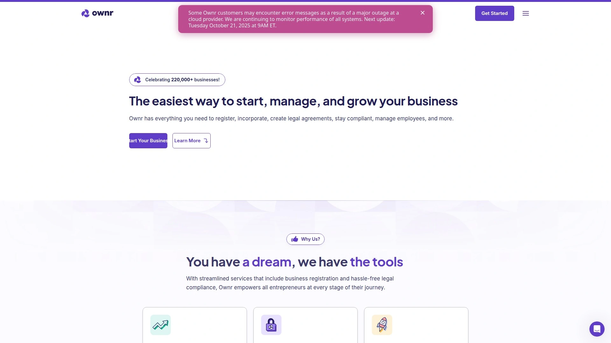

Ownr streamlines business registration across Canadian provinces and federal jurisdictions starting at $599-$699 including government fees. The platform generates complete company formation documents automatically based on information you provide during onboarding—corporate bylaws, shareholder resolutions, director consents, share subscriptions, and share issuances all appear tailored to your business structure within minutes. This eliminates the typical lawyer fees that run hundreds of dollars higher while ensuring nothing gets missed.

The service operates through two main plans: Online Minute Book ($199/year for already-incorporated businesses) and Managed Corporation ($599/year plus $499 incorporation fee for new companies). Both include automatic annual returns filed with government agencies, eSignature collection for all corporate documents, and secure cloud storage replacing traditional physical binders. The Managed Corporation plan adds unlimited access to legal agreement templates, unlimited company updates like address or director changes, and priority support.

After incorporation, Ownr continues handling compliance automatically—preparing annual returns, filing them with government agencies, gathering required signatures, and saving everything to your account. The platform also offers add-ons for GST/HST registration, share management (issuing, transferring, repurchasing shares plus shareholder agreements), and employee/contractor management. RBC business banking customers receive up to $300 cashback when incorporating through Ownr.

## **[ZenBusiness](https://www.zenbusiness.com)**

US-focused LLC formation starting at $0 plus state fees with three service tiers, free annual report filing in Pro/Premium plans, and a 60-day money-back guarantee.

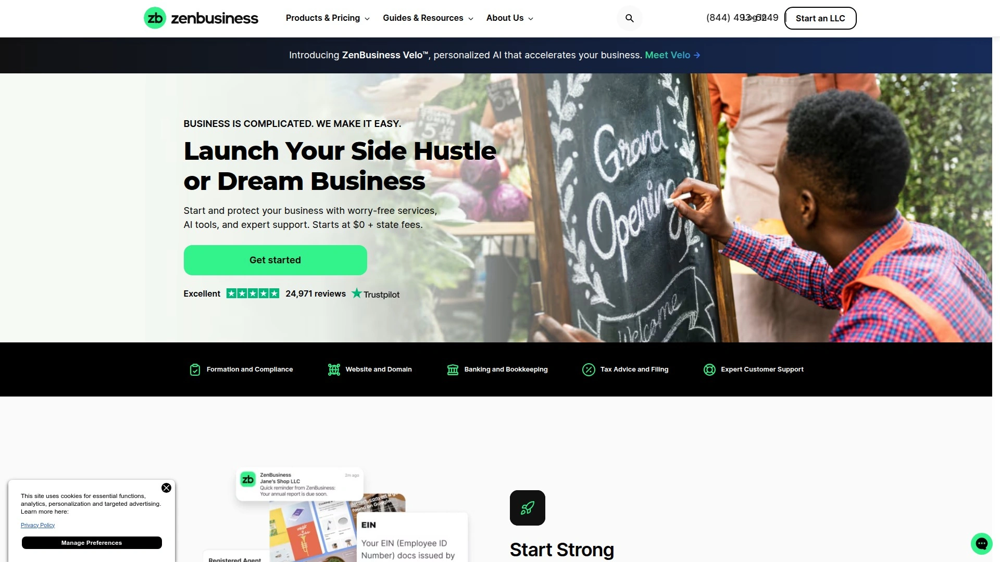

ZenBusiness structures LLC formation through Starter ($0), Pro ($199/year), and Premium ($299/year) packages. The Starter package covers essentials—business name verification and filing Articles of Organization with your state. Pro adds an operating agreement, EIN obtainment, annual report filing, and up to two amendments to formation documents yearly. Premium builds on Pro with website builder, domain name, business email, document templates for contracts and employment agreements, plus personalized guidance from their premium support team.

Registered agent service costs $199/year as an add-on across all packages. Processing times vary: Basic takes 7-10 days to prepare and submit filings, while Pro and Premium complete preparation in one day before state submission. The platform earns consistent praise for customer service quality, with representatives demonstrating patience and clarity when explaining complex processes. All customers access phone, email, and live chat support regardless of package choice.

The company offers grants to entrepreneurs, including opportunities to win $5,000 through their formation program. Additional services include worry-free compliance tracking, business banking setup, tax consultation, and bookkeeping subscriptions. ZenBusiness has formed hundreds of thousands of companies since launching and maintains strong ratings across review platforms.

## **[LegalZoom](https://www.legalzoom.com)**

Established legal services platform offering both LLC and corporation formation with tiered packages starting at $0, backed by 20+ years of experience forming 4+ million businesses.

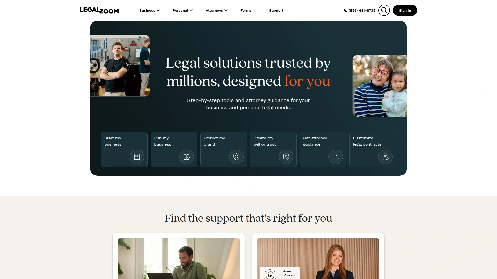

LegalZoom provides three corporation packages: Economy ($149 plus state fees) includes name availability checks and Articles of Incorporation filing, Standard ($329 plus state fees) adds small business guidance, and Express Gold ($349 plus state fees) includes 30-day attorney consultation subscriptions plus additional business services. For LLCs, packages start at $0 for Basic, $249 for Pro, and $299 for Premium. Processing takes 10-14 business days for Economy packages, with faster times for upgraded tiers.

Registered agent service runs $249/year as a separate purchase, not included in formation packages. EIN obtainment isn't bundled with formation—it's available combined with bylaws and resolutions for $178, or with bylaws, resolutions, and electronic signatures for $307. S corp election costs $60 extra. The platform uses guided questionnaires that make legal forms accessible even without legal expertise.

Customer feedback highlights concerns about upselling during checkout and subscription auto-renewals that some users found unexpected. LegalZoom delivers approved documents either via mail or digital download depending on document type and state requirements. The company also offers DBA registration, business licenses, trademark services, and various legal document creation beyond formation.

## **[Northwest Registered Agent](https://www.northwestregisteredagent.com)**

Premium LLC formation service at $39 plus state fees with first-year free registered agent service, address privacy protection, and lifetime customer support—no upsells during checkout.

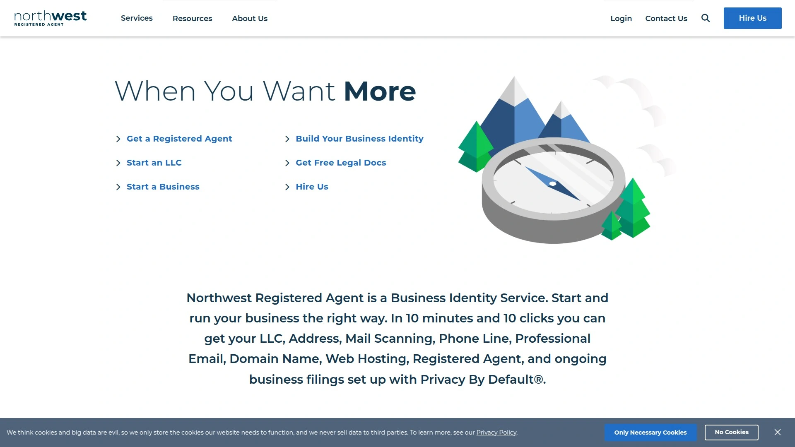

Northwest charges a flat $39 service fee plus state filing costs for LLC formation. This includes first-year registered agent service free (then $125/year), which stands out as genuinely free rather than promotional pricing that increases dramatically after trial periods. The company maintains physical offices in all 50 states and has operated for over 20 years. Their unique address privacy feature keeps your personal address off public records—something no other major provider offers.

Customer support consistently receives exceptional ratings, with representatives answering complex questions clearly and patiently. The company employs dedicated "Corporate Guides" who provide ongoing support through phone and email rather than outsourcing to call centers. Processing happens quickly once you submit required information, though delays occur if you don't complete the confirmation step promptly.

Additional services include EIN obtainment ($50 for those with SSN/ITIN, $200 for non-US residents), Operating Agreements ($50), annual report filing ($100/year), and certificates of good standing (pricing varies by state). Northwest doesn't engage in upselling tactics during checkout and maintains transparent pricing throughout. The error-free guarantee covers any corrections needed if filing mistakes occur at no cost to customers.

## **[Bizee](https://bizee.com)**

Formerly Incfile, this provider offers free LLC formation (just state fees) with one year of registered agent service included, plus lifetime compliance alerts and an intuitive online dashboard.

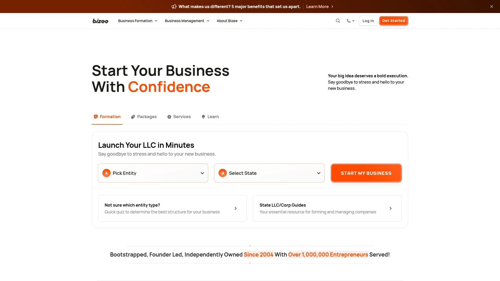

Bizee structures services into Basic ($0 plus state fee), Standard ($199 plus state fee), and Premium ($299 plus state fee) packages. The Basic package files Articles of Organization at no service charge—customers only pay mandatory state filing fees—and includes unlimited name searches plus one year of free registered agent service. Standard adds EIN obtainment, S-Corporation election filing, operating agreement, lifetime company alerts, online dashboard access, tax consultation, banking resolution, and business bank account setup. Premium builds on Standard with business email, domain name, contract templates, and enhanced ongoing support.

After the first free year, registered agent service renews at $119 annually. The platform processes filings quickly and provides user-friendly workflows that guide entrepreneurs through each step without overwhelming legal jargon. An online dashboard consolidates all documents, compliance reminders, and important updates in one accessible location. Bizee also offers grants including the Fresh Start Business Grant ($2,500 cash plus free Standard package) and Young Entrepreneur Scholarship ($2,500).

Customer reviews highlight excellent user-friendliness and resource availability, including free tools like business name generators, entity type quizzes, and sales tax calculators. Some customers report inconsistent customer service quality and unexpected cancellation fees, though most experiences remain positive. The company rebranded from Incfile to Bizee but maintains identical services and pricing structures.

## **[Rocket Lawyer](https://www.rocketlawyer.com)**

Subscription-based legal services offering free business formation (plus state fees) with Rocket Legal+ membership, which also provides unlimited document access and legal consultations.

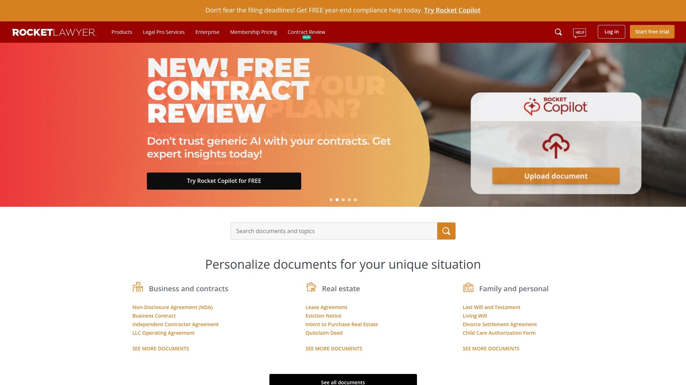

Rocket Lawyer operates through subscription tiers: Rocket Legal ($39.99/month) and Rocket Legal+ ($239.88/year). Both include unlimited personal and business document access, electronic signatures, and online Q&A for legal/tax questions. Business incorporation costs $99.99 per filing without subscription, but Rocket Legal+ members get their first registration free (plus state fees) with 50% off subsequent filings. The subscription model means registered agent service ($124.99 vs $249 full price) and other services receive significant discounts for members.

The incorporation process follows simple steps: enter business details, select business structure and state, customize with add-ons like EIN or registered agent, review information, and finalize checkout. If choosing S corp classification, Rocket Lawyer prepares and files IRS Form 2553 for $49.99 with Rocket Legal+ or $99.99 at regular pricing. A 7-day free trial allows creation of up to three legal documents with eSignatures and document management tools before automatic renewal.

The platform provides corporate bylaws creation, operating agreements for LLCs, and various legal document templates. Members can consult with attorneys for 30-minute sessions about business basics, though this represents general guidance rather than personalized legal advice. The subscription automatically renews unless canceled, which some customers find unexpected if they're not carefully tracking billing cycles.

## **[CorpNet](https://www.corpnet.com)**

Full-service business filing provider founded in 1997 with SOC 2 compliance, API solutions for high-volume orders, and comprehensive post-formation support.

CorpNet offers business formation packages starting at $79 for basic services, with mid-level packages around $199 and premium packages at $249 or higher (all plus state fees). The platform supports sole proprietorships, partnerships, LLCs, corporations, professional entities, and nonprofits across all 50 states. Services include not just formation but ongoing compliance monitoring, annual report filing, registered agent services, EIN obtainment, business licenses, and amendments.

The company was founded by incorporation industry pioneers Nellie and Phil Akalp and has formed over 500,000 companies since 1997. Their SOC 2 compliance certification ensures stringent security practices for sensitive business data. CorpNet provides API solutions for professional service providers, accountants, and larger firms needing white-label business filing capabilities with real-time order updates and automated compliance monitoring.

Pricing transparency distinguishes CorpNet from competitors—they clearly outline what's included in each package without hidden fees or confusing upsells. Live professionals assist throughout the formation process and remain available afterward for compliance questions. The automated compliance platform tracks filing due dates, sends alerts, submits annual reports, and maintains document portals so businesses never miss critical deadlines.

## **[Tailor Brands](https://www.tailorbrands.com)**

All-in-one business platform combining LLC formation with AI-powered logo design, website building, and branded merchandise starting at $0 plus state fees.

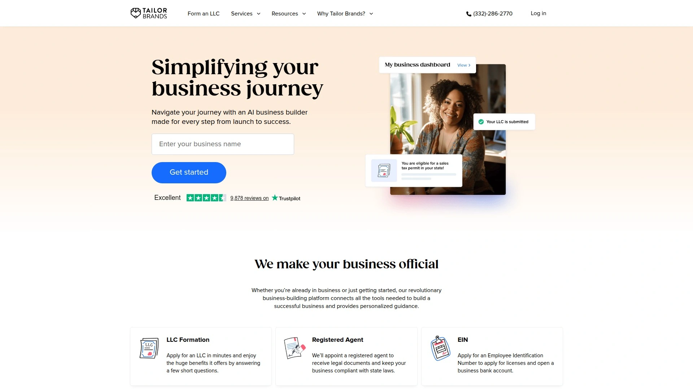

Tailor Brands structures LLC packages as Lite ($0 plus state fees), Essential ($199 plus state fees), and Elite ($249 plus state fees). Lite includes formation filing, 30-day trial for invoicing/bookkeeping tools, and business coaching program access. Essential adds operating agreement, annual report filing, two-business-day processing before state submission, and an Amazon gift card. Elite includes online business and branding tools (website, logos, domain hosting for one year) plus a higher-value Amazon gift card.

Processing takes up to 14 business days with Lite (expedited service available for $49), while Essential and Elite include two-day processing before state submission. Registered agent service costs $199/year separately and isn't available as a standalone service outside formation packages. The platform emphasizes branding alongside legal formation—AI logo creation, website builders, social media post makers, and business card tools integrate into the user experience.

Additional services include website creation ($2.90-$49.99/month), business insurance (starting at $500), taxes and bookkeeping ($125/month), and compliance handling ($199/year). The platform has served over 30 million clients and maintains a 4-star Trustpilot rating from 3,000+ reviews. Some customers report aggressive upselling during the signup process, though the core services deliver as promised.

## **[MyCompanyWorks](https://www.mycompanyworks.com)**

Straightforward LLC formation with same-day processing included in all packages, strong DBA filing services, and transparent pricing starting at $79 plus state fees.

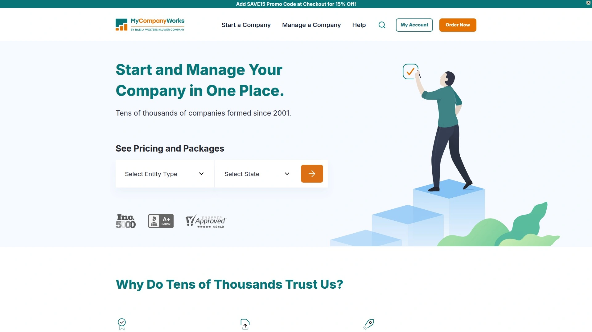

MyCompanyWorks offers Basic ($79 plus state fees), Entrepreneur ($199 plus state fees), and Complete ($279 plus state fees) packages. Basic includes name availability checks, Articles of Organization filing, personalized operating agreement, same-day processing, meeting minutes template, banking resolution, and electronic document delivery—more comprehensive than most competitors' entry-level offerings. Entrepreneur adds MyCompanyForms legal template library, one year of registered agent service, and EIN obtainment. Complete includes everything from previous packages plus one year of MyCompanyWorks Premium subscription service.

Same-day processing comes standard across all packages at no extra charge—submissions received early get filed with the state that same day, evening submissions go out next business day. Competitors typically charge $50+ for expedited filing, making this a significant value add. Registered agent service costs $119/year after the first free year with Entrepreneur or Complete packages. The company scans incoming mail and uploads to your dashboard, FedExing service of process documents at no extra charge.

MyCompanyWorks excels at DBA (Doing Business As) filings for $99 plus state fees. They explain DBA pros and cons clearly and perform preliminary checks to verify state acceptance before filing, unlike competitors who file blindly and request alternate names after rejection. The platform handles both state and county-level DBA registrations depending on business location. Founded in 2001, the company has formed over 60,000 businesses.

## **[Firstbase.io](https://www.firstbase.io)**

International entrepreneur-focused platform offering US business formation, remote bank account setup without EIN, and all-in-one compliance starting at $399.

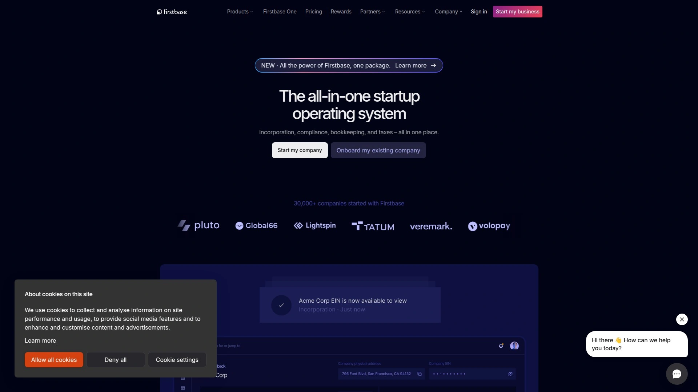

Firstbase specializes in helping non-US residents establish US businesses through LLC or C corporation formation in Delaware or Wyoming. The platform handles all incorporation paperwork, state filings, and compliance measures while providing 24/7 global customer support. A standout feature allows bank account setup before receiving an EIN from the IRS, accelerating the business launch timeline significantly. Firstbase is authorized by the IRS for expedited EIN services when needed.

The $399 package includes incorporation, beneficial ownership filings on autopilot, virtual business address and mailbox, and access to $200,000+ in exclusive deals plus free tax and legal consultations. Additional services include registered agent ($149/year), dedicated bookkeeping, banking applications, payment processing, and payroll setup—all accessible through one platform. The company offers 7-day money-back guarantees minus state and third-party fees if you're unsatisfied for any reason.

Firstbase emphasizes compliance automation, putting ongoing filings, annual reports, and beneficial ownership reports on autopilot so founders never miss deadlines. The virtual mailbox lets you manage all mail online from any device. Their API solution allows other platforms to embed US incorporation into their product suites, supporting co-investment, SPV creation, and back-office systems. Major investors including Y Combinator back the company.

## **[Canada Incorporation Agency](https://incorporationagency.ca)**

Federal and provincial incorporation across Canada with 1-hour rush service available, comprehensive corporate filings, and membership in Corporations Canada.

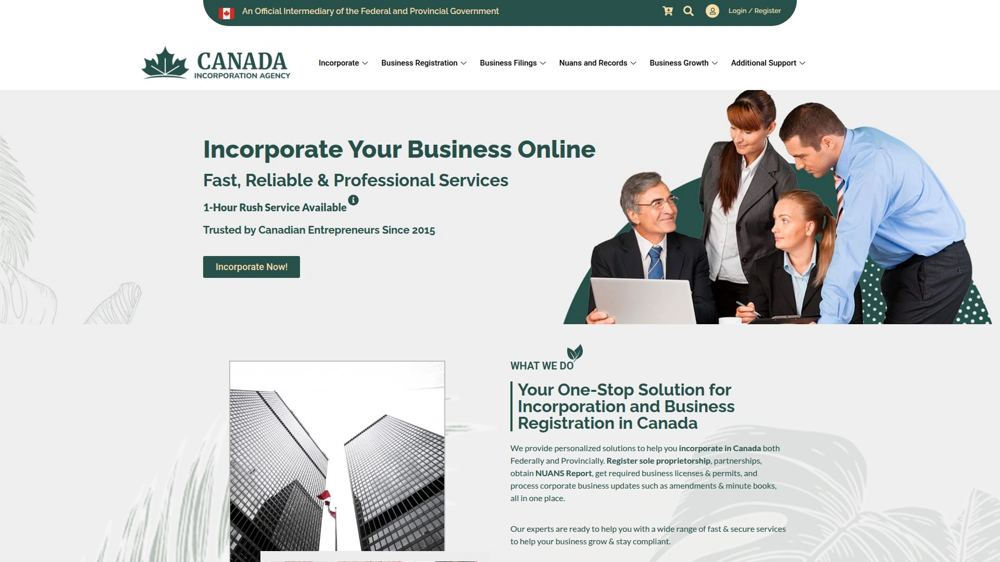

Canada Incorporation Agency provides personalized incorporation solutions for both federal and provincial jurisdictions across Canada. Services include Ontario incorporation, federal Canada incorporation, business name registry, corporate filings, notice of changes, and corporate searches. The agency processes incorporations in as little as one business hour with rush service options, making them among the fastest Canadian providers. They handle NUANS reports, business licenses, permits, and corporate updates like amendments and minute books.

Federal incorporation secures your corporate name across Canada and offers national business recognition, ideal for companies planning multi-province operations. Provincial incorporation (like Ontario) protects personal assets, lowers tax rates, enhances business credibility, and provides ownership flexibility under provincial laws. Business name registry allows operating under a trade name different from your corporation's legal name, supporting brand identity and regulatory compliance.

The four-step process involves choosing a business name, preparing documents (instant, preliminary, or agent-assisted options), filing online securely, and receiving your certificate within hours once approved. Corporate searches provide official records about legal status, ownership, and filings essential for due diligence and business verification. The agency collaborates with numerous incorporation professionals across Canada including Business Canada, Incorp Pro, and MD Legals.

## **[Incorporation.ca](https://incorporation.ca)**

Canadian incorporation specialists offering federal and provincial registration, minute book maintenance, and corporate compliance services across all Canadian provinces and territories.

*Based on search results indicating this is a Canadian incorporation service provider similar to other Canadian services found in research.*

This Canadian service handles complete business registration from name searches through annual compliance filings. The platform generates all required corporate documents including articles, bylaws, resolutions, and share certificates. Services span federal incorporation providing Canada-wide name protection and provincial incorporation tailored to specific regional requirements and lower costs.

Minute book maintenance keeps all corporate records organized and accessible online, eliminating traditional physical binders. The service includes annual return preparation and filing with government agencies, director and officer change processing, and share structure modifications. Compliance alerts ensure businesses never miss critical filing deadlines that could jeopardize good standing status.

Additional offerings include registered office services, extra-provincial registrations for businesses expanding to new provinces, and NUANS name search reports required for federal and most provincial incorporations. The platform emphasizes accessibility for entrepreneurs without legal backgrounds through plain-language explanations and step-by-step guidance.

## **[Swyft Filings](https://www.swyftfilings.com)**

Business formation service with premium packages starting at competitive rates, focus on quick turnaround times, and straightforward filing processes across all US states.

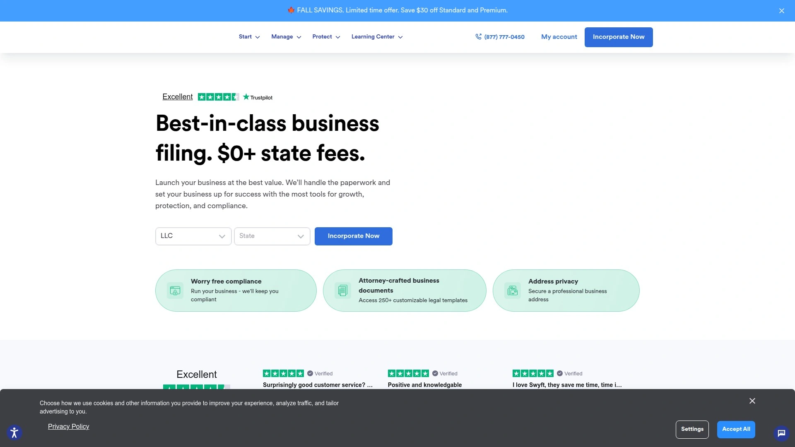

*Based on research indicating Swyft Filings as a legitimate business formation provider mentioned in industry comparisons.*

Swyft Filings offers tiered business formation packages covering LLCs, corporations, and nonprofits across all 50 states. The service includes name availability verification, articles of organization or incorporation filing, and delivery of approved documents. Processing times vary by package level, with expedited options available for faster state approval.

Registered agent service is provided separately from formation packages, typically offered as an add-on at annual rates competitive with industry standards. The platform emphasizes simplicity throughout the registration process, guiding users through required information collection without overwhelming legal terminology.

Post-formation services include annual report filing, compliance monitoring, amendments to corporate documents, and dissolution services. The company maintains transparent pricing with clear explanations of what each package includes and what requires additional fees. Customer support assists via phone and email throughout the formation process and afterward.

## **[Inc Authority](https://www.incauthority.com)**

Budget-friendly business formation with focus on startups, offering free LLC formation services (customers pay only state fees) with optional add-on services.

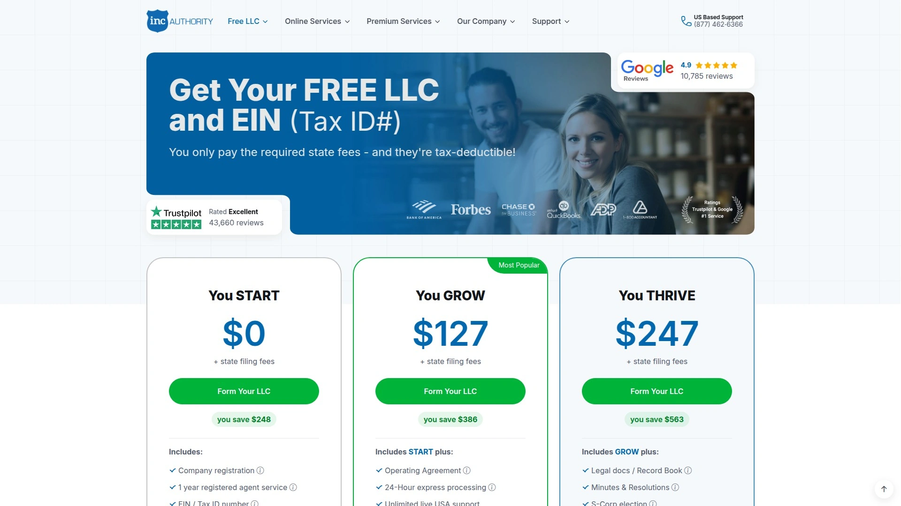

*Based on research indicating Inc Authority as a business formation provider appearing in industry rankings.*

Inc Authority emphasizes affordability for new entrepreneurs through free LLC formation where customers pay only mandatory state filing fees. The basic service handles preparation and filing of articles of organization or incorporation documents with state agencies. Name availability checks and basic support come included at no additional service charge.

Optional add-ons include registered agent service at annual rates, EIN obtainment from the IRS, operating agreements for LLCs, corporate bylaws for corporations, and expedited processing for faster state approval. The platform targets startups and first-time business owners seeking to minimize upfront costs while establishing proper legal structure.

The company processes formations across all US states and provides tracking updates as documents move through state approval workflows. Customer support guides users through information requirements and answers questions about business structure selection. Post-formation compliance reminders help businesses maintain good standing with annual reports and other required filings.

## **[BusinessAnywhere.io](https://businessanywhere.io)**

Zero-paperwork business registration platform combining company formation with virtual mailbox, banking, notary, and registered agent services all in one dashboard.

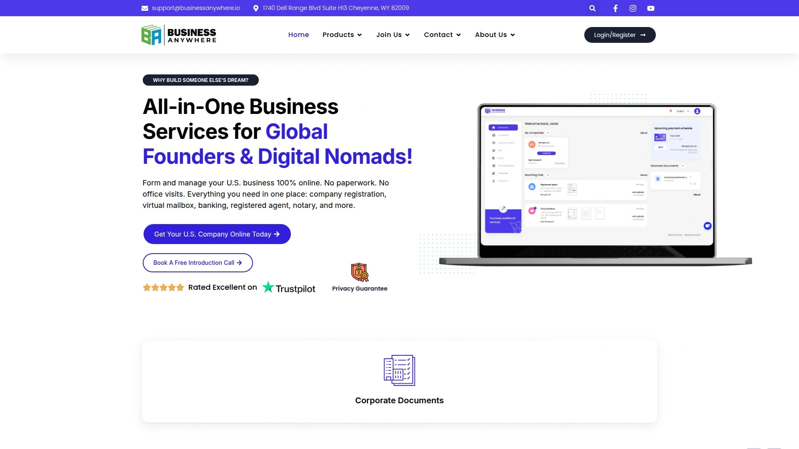

BusinessAnywhere.io positions itself as a comprehensive business operations platform beyond simple formation. The service includes company registration, virtual mailbox for business mail management, banking integrations, registered agent services, and notary services accessible through a unified interface. The platform eliminates office visits and physical paperwork by handling everything digitally.

Virtual mailbox services provide a professional business address for receiving mail while you work remotely or internationally. Incoming mail gets scanned and viewable online immediately, with options to forward physical items when necessary. This pairs with registered agent service to ensure you never miss legal notices or government correspondence regardless of location.

Banking integrations streamline business account setup and financial management directly within the platform. Notary services handle document authentication remotely, avoiding the need to find local notaries for corporate paperwork. The all-in-one approach means businesses manage formation, compliance, mail, banking, and legal requirements from a single account rather than juggling multiple providers.

## **How quickly can online incorporation services actually form my business?**

Processing times split into two parts: the service provider's preparation time and your state's approval time. Basic packages from budget providers take 7-14 business days to prepare and submit your documents, while premium tiers often promise 1-2 day preparation. Once filed, state approval varies dramatically—some states process electronically within 24-48 hours, others take 2-4 weeks for manual review. Rush services can expedite state processing to same-day or next-day in many jurisdictions for extra fees ranging from $50-$200. The fastest overall timeline comes from premium packages with rush filing in electronic-processing states, potentially completing in 2-3 days total.

## **What's actually included versus what costs extra?**

Base packages typically include name availability checks, preparation and filing of formation documents (articles of organization/incorporation), and delivery of approved documents. Almost everything else costs extra: registered agent service ($119-$249/year), EIN obtainment ($50-$100 or free if you DIY), operating agreements ($50-$100), corporate bylaws ($50-$150), annual report filing ($100-$150/year), and expedited processing ($49-$100). Some providers bundle these into higher-tier packages, which can save money compared to adding individually. Watch for services listed as "included" that turn out to be limited-time trials that auto-renew at full price.

## **Should I use my state's DIY filing or pay for a service?**

DIY filing through your state's website costs only the mandatory filing fee ($50-$500 depending on state and entity type), but you're responsible for understanding requirements, generating compliant documents, and handling follow-up communications. Incorporation services add $0-$500 in service fees but handle document preparation, ensure compliance with state-specific rules, provide templates for corporate documents your state doesn't generate, and monitor filing status. Services make sense if you're unfamiliar with business law, value time savings over cost savings, or need the additional documents (operating agreements, bylaws) that states don't provide. DIY works if you're comfortable researching requirements and have time to handle potential rejections or corrections.

## Conclusion

Online incorporation platforms collapse what used to take weeks of lawyer consultations and government office visits into automated workflows you complete from home in under an hour. **[Ownr](https://www.ownr.co)** particularly suits Canadian entrepreneurs and small businesses needing comprehensive corporate document management beyond just initial registration—the platform's automatic annual compliance handling, secure digital minute book replacing physical binders, and included legal agreement templates mean you're not just incorporating but establishing proper corporate governance from day one. Whether you choose the Online Minute Book plan for existing corporations or Managed Corporation for new businesses, the ongoing compliance automation and unlimited company updates eliminate the administrative burden that causes many small businesses to fall out of good standing accidentally. For entrepreneurs prioritizing long-term compliance over just getting registered quickly, this approach prevents expensive problems down the road.
